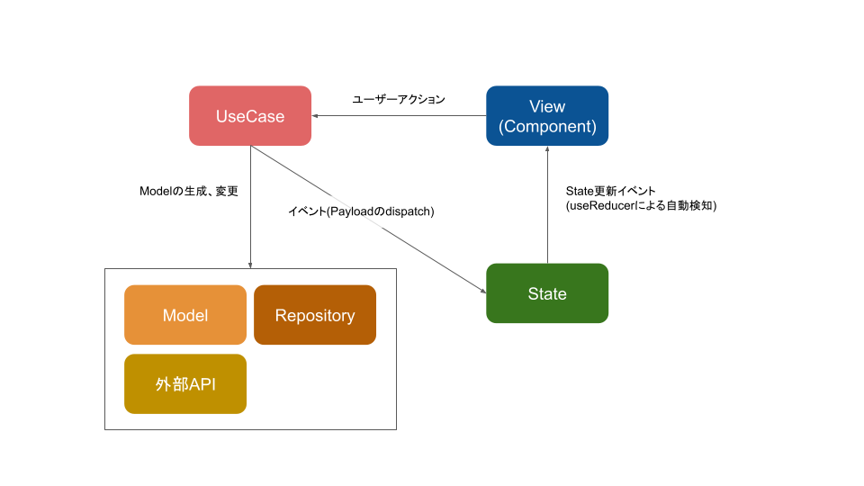

# データの流れ

## 概略図



## アプリの初期化フロー

以下は大まかなアプリの初期化から表示の更新におけるフローです。

1. 必要なものの初期化
   - ドメインの初期化
   - Repository への保存
   - データベース(localStorage やメモリキャッシュ等)の初期化
2. AppContainer(Root となるコンポーネント) のマウント
3. 初期描画
4. ルーティング(Router コンポーネントでのルーティング)
5. ページコンポーネントの描画
   1. ステートの更新
   2. 各コンポーネントの描画

これ以降は、[UseCase](./usecase.md)を使い、[Model](./model.md)や[State](./state.md)を更新する。
ページコンポーネントは State の変更を監視しているため、State が変更される度に Component を更新するのが基本的な表示の更新フローです。

## 更新のパターン

### State を直接更新するパターン

いわゆる Flux パターンでの実装です。
基本的にはこちらの流れでデータを更新していきます。

```
Component -> (user action) -> UseCase -> (dispatch paylaod) -> State -> Component -> ...
```

<!-- State のみに存在する情報を更新したいときに、Payload を`dispatch`し更新を行う。 -->

### リポジトリを用いて永続化するパターン

CQRS 的にリポジトリを用いて、モデルを永続化するケースもあります。  
(localStorage やキャッシュを使うパターンなど)  

```
Component -> (user action)-> UseCase -> Model -> Repository -> State -> View -> ...
```

※ アーキテクチャの参考にしているAlmin.jsではこちらのフローが一般的ですが、ネクストではFluxパターンを基本とします。(一部ではこちらも使っています。)  

## 各クラスの概要

### Component

ユーザーアクションやポーリングなどにより UseCase を生成し実行する。  
UseCase 実行時に必要なデータを渡す。

Container Component と Presentation Component の 2 種類がある。  
詳細は[Component](./component.md)を参照。

### UseCase

受け取ったデータを必要に応じて加工し、イベント(Payload)を発する。  
もしくは、受け取ったデータを用いて、model の生成、変更を行い、結果を Repository に保存する。  

### Model

生成されたり、変更される対象。  
扱われるデータのひとつなので、モデルが他クラスにデータを渡すことはない。  

### Repository

永続化周りの処理を担当。  
データの保存が行われた際に、State へ向けたイベントを発する。

### State

生成されたり、変更される対象。  
View を意識したデータを持ち、UseCase のイベントの処理を行う。

# 実装フロー例

## ボタンを追加したい

※ この順で実装すべきというものではなく、あくまで参考です。

### Component の用意

- components 下に HogeButton/HogeButton.tsx を追加する
- containers 下から、HogeButton を利用したい container に HogeButton を配置する

詳細は [Component](./component.md) を参照してください。

### UseCase の追加や利用

すでに HogeButton を利用した際の UseCase がある場合は、container 内で HogeButton のハンドラを定義し、HogeButton へ渡す。  
※ components 下では UseCase に依存させないため、container でハンドラを定義する。  

UseCase がない場合は新規に作成し、それを利用する。  
(詳細は [UseCase](./usecase.md) を参照してください。)  

### Domain の関数/プロパティの追加や変更

既存の関数で要件が満たせない場合は、関数の追加や変更を行う。  
また、新規プロパティが必要な場合は追加を行う。  
(詳細は [Model](./model.md) を参照してください。)  

### State の変更

Model の変更を受けて State のプロパティの変更、getter 関数を修正したりする。  
(詳細は [State](./store.md) を参照してください。)  

### Component の変更

State の変更により、表示内容に変更がある場合は、props の追加や処理の変更を行う。
